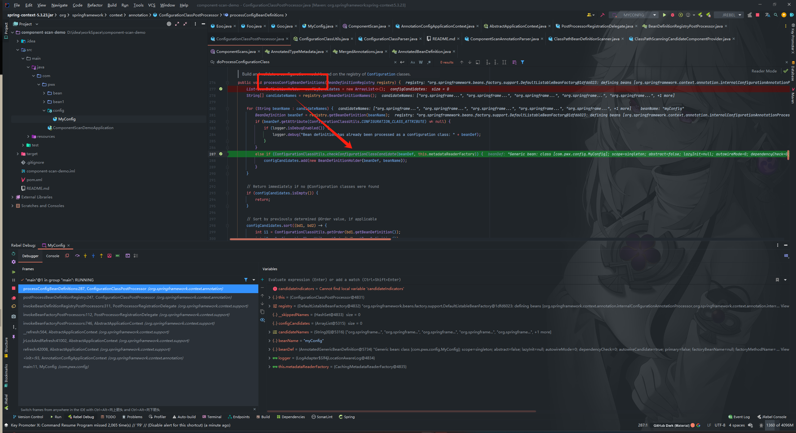
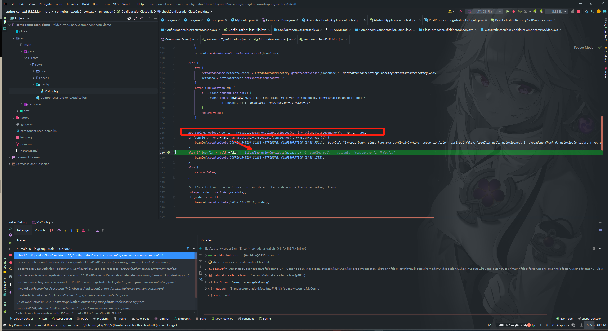
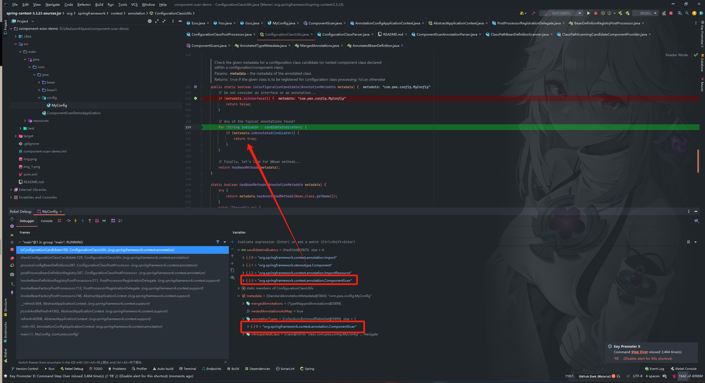
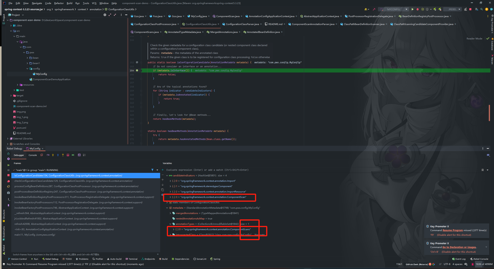

# @ComponentScan使用及原理详解

## 引入

在使用Spring Boot的过程中，基于MVC三层架构，我们会用到大量的@RestController,@Service...等注解，即使这些类在不同包路径下，都能被注入到Spring容器中。

那么，问题来了：
- Spring是如何讲声明了这些注解的Bean注入到Soring容器中的呢
- 怎么做到bean的类定义可以随意写在不同包路径下

这就是我们今天的主角：@ComponentScan 的功劳了。

它告诉Spring扫描哪些包路径下的类，然后将注解了@Component，@Service...等注解的类注入到容器中。

接下来我们一起来看看这个类的源码。

## @ComponentScan 是什么
@ComponentScan 的定义，比起之前的两个注解，会稍微复杂一些
```java
@Retention(RetentionPolicy.RUNTIME)
@Target(ElementType.TYPE)
@Documented
@Repeatable(ComponentScans.class)//可重复注解
public @interface ComponentScan {

   @AliasFor("basePackages")
   String[] value() default {};//基础包名，等同于basePackages

   @AliasFor("value")
   String[] basePackages() default {};//基础包名，value

   Class<?>[] basePackageClasses() default {};//扫描的类，会扫描该类所在包及其子包的组件。

   Class<? extends BeanNameGenerator> nameGenerator() default BeanNameGenerator.class;//注册为BeanName生成策略 默认BeanNameGenerator，用于给扫描到的Bean生成BeanName

   Class<? extends ScopeMetadataResolver> scopeResolver() default AnnotationScopeMetadataResolver.class;//用于解析bean的scope的属性的解析器，默认是AnnotationScopeMetadataResolver

   ScopedProxyMode scopedProxy() default ScopedProxyMode.DEFAULT;//scoped-proxy 用来配置代理方式 // no(默认值)：如果有接口就使用JDK代理，如果没有接口就使用CGLib代理 interfaces: 接口代理（JDK代理） targetClass：类代理（CGLib代理）

   String resourcePattern() default ClassPathScanningCandidateComponentProvider.DEFAULT_RESOURCE_PATTERN;//配置要扫描的资源的正则表达式的，默认是"**/*.class"，即配置类包下的所有class文件。
  
   boolean useDefaultFilters() default true;//useDefaultFilters默认是true，扫描带有@Component ro @Repository ro @Service ro @Controller 的组件

   Filter[] includeFilters() default {};//包含过滤器

   Filter[] excludeFilters() default {};//排除过滤器

   boolean lazyInit() default false;//是否是懒加载

   @Retention(RetentionPolicy.RUNTIME)
   @Target({})
   @interface Filter {//过滤器注解

      FilterType type() default FilterType.ANNOTATION;//过滤判断类型

      @AliasFor("classes")
      Class<?>[] value() default {};//要过滤的类，等同于classes

      @AliasFor("value")
      Class<?>[] classes() default {};//要过滤的类，等同于value

      String[] pattern() default {};// 正则化匹配过滤

   }

}

```

我们大部分属性都只会使用默认，一般只需要配置一下basePackages即可

接下来，我们肯定要写几个类玩一玩

先在包路径1（我的是com.pwx.bean）在建几个类
```java
@Component
public class Coo {
}

@Repository
public class Doo {
}

@Service
public class Eoo {
}

@RestController
public class Foo {
}
```
然后在另一个包路径下（com.pwx.bean1）再定义一个类
```java
@Component
public class Goo {
}
```
最后声明一个类，使用@ComponentScan注解进行包扫描：
```java
@ComponentScan("com.pwx.bean")
public class MyConfig {
    public static void main(String[] args) {
        AnnotationConfigApplicationContext applicationContext = new AnnotationConfigApplicationContext(MyConfig.class);
        String[] beanDefinitionNames = applicationContext.getBeanDefinitionNames();
        // 遍历Spring容器中的beanName
        for (String beanDefinitionName : beanDefinitionNames) {
            System.out.println(beanDefinitionName);
        }
    }
}
```
执行结果：
```text
myConfig
coo
doo
eoo
foo
```
我们发现Goo没有注入到Spring容器中，因为我们扫描的包路径是com.pwx.bean，但是它在com.pwx.bean1，所以没有被扫描到

如果想被扫描到，那代码就要改成这样
```java
@ComponentScan(basePackages = {"com.pwx.bean", "com.pwx.bean1"})
public class MyConfig {
    public static void main(String[] args) {
        AnnotationConfigApplicationContext applicationContext = new AnnotationConfigApplicationContext(MyConfig.class);
        String[] beanDefinitionNames = applicationContext.getBeanDefinitionNames();
        // 遍历Spring容器中的beanName
        for (String beanDefinitionName : beanDefinitionNames) {
            System.out.println(beanDefinitionName);
        }
    }
}
```
执行结果：
```text
myConfig
coo
doo
eoo
foo
goo
```

## @ComponentScan的实现原理
@ComponentScan的底层实现流程和之前我们分析 @Import实现原理基本一致的，都是依靠配置类后置处理器ConfigurationClassPostProcessor进行处理、解析的


checkConfigurationClassCandidate(beanDef, this.metadataReaderFactory) 为判断当前bean(这里就是上面的定义的MyConfig类)是不是配置类，是的话加入配置类候选集合
之后点进去

到下面里，我们可以看到，这里判断当前是不是配置类，是配置类还分是FULL模式或LITE模式，两种模式的区别之前我们总结过，请查看[@Configuration 和 @Component区别](https://blog.csdn.net/qq_43602877/article/details/135200926)，上面定义的MyConfig没有用@Configuration注解，所以config是null，所以接下来会进入到方法isConfigurationCandidate(metadata)

在配置类LITE模式匹配规则匹配成功后，判断当前是配置类，继续往下解析，又回到了我们熟悉的ConfigurationClassParser.doProcessConfigurationClass

这里我们只看和@ComponentScan相关的部分
```java
class ConfigurationClassParser {
    
    protected final SourceClass doProcessConfigurationClass(
            ConfigurationClass configClass, SourceClass sourceClass, Predicate<String> filter)
            throws IOException {
        
        //.....

        // Process any @ComponentScan annotations  解析@ComponentScan核心所在
        // 这里是调用AnnotationConfigUtils的静态方法attributesForRepeatable，获取@ComponentScan注解的属性
        Set<AnnotationAttributes> componentScans = AnnotationConfigUtils.attributesForRepeatable(
                sourceClass.getMetadata(), ComponentScans.class, ComponentScan.class);
        if (!componentScans.isEmpty() &&
                !this.conditionEvaluator.shouldSkip(sourceClass.getMetadata(), ConfigurationPhase.REGISTER_BEAN)) {
            // for循环，遍历componentScans，此时仅有一个componentScan，使用componentScanParser解析器来解析componentScan这个对象
            for (AnnotationAttributes componentScan : componentScans) {
                // The config class is annotated with @ComponentScan -> perform the scan immediately
                Set<BeanDefinitionHolder> scannedBeanDefinitions =
                        // componentScanParser解析器进行解析
                        this.componentScanParser.parse(componentScan, sourceClass.getMetadata().getClassName());
                // Check the set of scanned definitions for any further config classes and parse recursively if needed
                // for循环扫描到的beanDefinition信息
                for (BeanDefinitionHolder holder : scannedBeanDefinitions) {
                    BeanDefinition bdCand = holder.getBeanDefinition().getOriginatingBeanDefinition();
                    if (bdCand == null) {
                        bdCand = holder.getBeanDefinition();
                    }
                    // 这里递归调用前面的配置类解析器的解析方法，也就是会再次来到doProcessConfigurationClass()这个方法，会匹配到方法一开始的对@Component解析逻辑
                    if (ConfigurationClassUtils.checkConfigurationClassCandidate(bdCand, this.metadataReaderFactory)) {
                        parse(bdCand.getBeanClassName(), holder.getBeanName());
                    }
                }
            }
        }

        //.....
    }
}

```
点进this.componentScanParser.parse(componentScan, sourceClass.getMetadata().getClassName());

```java
class ComponentScanAnnotationParser {
    public Set<BeanDefinitionHolder> parse(AnnotationAttributes componentScan, String declaringClass) {
        ClassPathBeanDefinitionScanner scanner = new ClassPathBeanDefinitionScanner(this.registry,
                componentScan.getBoolean("useDefaultFilters"), this.environment, this.resourceLoader);

        Class<? extends BeanNameGenerator> generatorClass = componentScan.getClass("nameGenerator");
        boolean useInheritedGenerator = (BeanNameGenerator.class == generatorClass);
        scanner.setBeanNameGenerator(useInheritedGenerator ? this.beanNameGenerator :
                BeanUtils.instantiateClass(generatorClass));

        ScopedProxyMode scopedProxyMode = componentScan.getEnum("scopedProxy");
        if (scopedProxyMode != ScopedProxyMode.DEFAULT) {
            scanner.setScopedProxyMode(scopedProxyMode);
        }
        else {
            Class<? extends ScopeMetadataResolver> resolverClass = componentScan.getClass("scopeResolver");
            scanner.setScopeMetadataResolver(BeanUtils.instantiateClass(resolverClass));
        }

        scanner.setResourcePattern(componentScan.getString("resourcePattern"));

        for (AnnotationAttributes includeFilterAttributes : componentScan.getAnnotationArray("includeFilters")) {
            List<TypeFilter> typeFilters = TypeFilterUtils.createTypeFiltersFor(includeFilterAttributes, this.environment,
                    this.resourceLoader, this.registry);
            for (TypeFilter typeFilter : typeFilters) {
                scanner.addIncludeFilter(typeFilter);
            }
        }
        for (AnnotationAttributes excludeFilterAttributes : componentScan.getAnnotationArray("excludeFilters")) {
            List<TypeFilter> typeFilters = TypeFilterUtils.createTypeFiltersFor(excludeFilterAttributes, this.environment,
                    this.resourceLoader, this.registry);
            for (TypeFilter typeFilter : typeFilters) {
                scanner.addExcludeFilter(typeFilter);
            }
        }

        boolean lazyInit = componentScan.getBoolean("lazyInit");
        if (lazyInit) {
            scanner.getBeanDefinitionDefaults().setLazyInit(true);
        }

        Set<String> basePackages = new LinkedHashSet<>();
        String[] basePackagesArray = componentScan.getStringArray("basePackages");
        for (String pkg : basePackagesArray) {
            String[] tokenized = StringUtils.tokenizeToStringArray(this.environment.resolvePlaceholders(pkg),
                    ConfigurableApplicationContext.CONFIG_LOCATION_DELIMITERS);
            Collections.addAll(basePackages, tokenized);
        }
        for (Class<?> clazz : componentScan.getClassArray("basePackageClasses")) {
            basePackages.add(ClassUtils.getPackageName(clazz));
        }
        if (basePackages.isEmpty()) {
            basePackages.add(ClassUtils.getPackageName(declaringClass));
        }

        scanner.addExcludeFilter(new AbstractTypeHierarchyTraversingFilter(false, false) {
            @Override
            protected boolean matchClassName(String className) {
                return declaringClass.equals(className);
            }
        });
        return scanner.doScan(StringUtils.toStringArray(basePackages));
    }
}
```
总结的来说，就是初始化了一个ClassPathBeanDefinitionScanner扫描器，根据@ComponentScan的属性，设置扫描器的属性，最后调用扫描器的doScan()方法执行真正的扫描工作。遍历扫描包，调用findCandidateComponents()方法根据基础包路径来找到候选的Bean。

这就是整个@ComponentScan的工作流程。

## 彩蛋
在@ComponentScan定义看到声明了@Repeatable(ComponentScans.class)，意味着该注解可以在同一个类中多次使用，这时候我想着使用两次分别指定不同的包扫描路径，解决前面Goo没有被扫描到的问题
```java
@ComponentScan("com.pwx.bean")
@ComponentScan("com.pwx.bean1")
public class MyConfig {
    public static void main(String[] args) {
        AnnotationConfigApplicationContext applicationContext = new AnnotationConfigApplicationContext(MyConfig.class);
        String[] beanDefinitionNames = applicationContext.getBeanDefinitionNames();
        // 遍历Spring容器中的beanName
        for (String beanDefinitionName : beanDefinitionNames) {
            System.out.println(beanDefinitionName);
        }
    }
}
```
执行结果：
```text
myConfig
```

按照我们上面的流程Debug下来，我们来到了这里

发现配置类LITE模式匹配规则里面并没有包含@ComponentScans注解，所以判断当前类不是配置类，自然不会再进行后面的相关注解解析了，这也就是上面多次使用@ComponentScan扫描注入不成功的问题。

这就算是一个小彩蛋了。